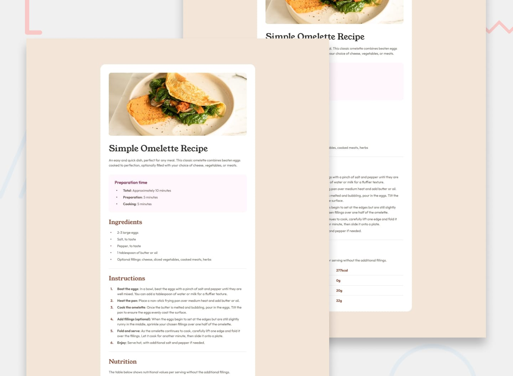

# 🍳 Recipe Page

A clean and responsive recipe page built using **HTML & CSS** as part of a Frontend Mentor challenge.

---

## 📸 Preview

---

## 🔗 Live Demo

- 🌐 Live Site: [[Site](https://abdelrhman-roma.github.io/frontend-mentor-recipe-page/)]
- 💻 Repository: [[Repo](https://github.com/Abdelrhman-Roma/frontend-mentor-recipe-page)]

---

## 🧠 About The Project

This project is a solution to the Frontend Mentor Recipe Page challenge.  
The goal was to build a visually accurate layout based on the provided design.

I focused on:
- Writing clean and semantic HTML
- Structuring content properly using sections
- Matching spacing, typography, and layout with CSS

---

## 🛠️ Built With

- HTML5
- CSS3 (Flexbox)
- Responsive Design principles

---

## 🎯 What I Learned

- Proper use of semantic HTML elements (`section`, `header`, `main`)
- How to center layouts using Flexbox instead of absolute positioning
- Styling lists using `::marker`
- Creating clean tables with `border-collapse`
- Controlling spacing and alignment precisely

---

## ⚡ Features

- Fully structured layout
- Clean and readable code
- Styled lists and table
- Pixel-accurate spacing (based on design)

---

## 🚀 Future Improvements

- Add responsiveness for mobile devices
- Improve typography with custom fonts
- Add animations or hover effects

---

## 🙋‍♂️ Author

- LinkedIn: https://www.linkedin.com/in/abdelrhmanroma
- Frontend Mentor: https://www.frontendmentor.io

---

## 📌 Acknowledgments

Thanks to Frontend Mentor for providing this challenge and design.

